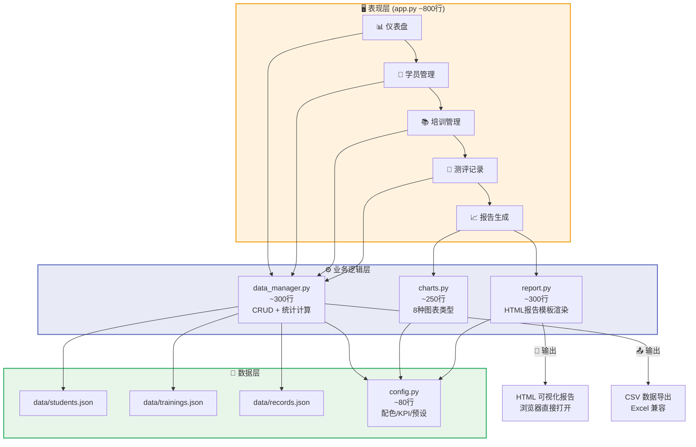

<div align="center">

# 🏢 Training Toolkit

> 用 AI 重塑企业培训全流程

[](#)
[](#)
[](#)
[](#)
[](#)

**培训效果纵向追踪系统** — 用数据证明每一场培训的价值

前后测对比、进步可视化、KPI 仪表盘、自动生成 HTML 报告，量化培训的投入产出。

🧩 **产品矩阵** → [知识库问答](https://github.com/ASJ-Alita/rag-knowledge-base) · [培训需求分析](https://github.com/ASJ-Alita/training-analyzer) · [培训效果评估](https://github.com/ASJ-Alita/kirkpatrick-eval) · [智能出题](https://github.com/ASJ-Alita/quiz-generator) · [培训助手](https://github.com/ASJ-Alita/training-assistant)

</div>

---

# 📊 培训效果追踪器

> **Training Effectiveness Tracker** — 基于前后测的培训效果纵向追踪系统

一款面向企业培训管理者的人效追踪工具，通过前测/后测对比、进步可视化、HTML报告生成，量化每一次培训的投入产出。

---

## 🎯 核心功能

| 模块 | 功能 |
|------|------|
| 📊 **仪表盘** | 在册学员数 / 培训数 / 测评记录 / 平均进步率，实时一览 |
| 👥 **学员管理** | 学员建档、编辑、搜索、关联培训 |
| 📚 **培训管理** | 培训计划新增、编辑、关联主题 |
| 📝 **测评记录** | 前测/后测/里程碑成绩录入，支持筛选 |
| 📈 **报告生成** | 个人进步报告 + 班级汇总报告（HTML，可浏览器打开） |
| 📤 **数据导出** | 一键导出全部数据为CSV |
| 🎭 **演示数据** | 一键注入6学员×3培训×36条记录，立即体验 |

---

## 📂 项目结构

```
training-tracker/
├── app.py             # GUI主程序（5个Tab，~800行）
├── data_manager.py    # 数据管理（学员/培训/记录 CRUD+统计，~300行）
├── report.py          # HTML报告生成（个人+班级报告，~300行）
├── charts.py          # 可视化图表（8种图表类型，~250行）
├── config.py          # 配置（配色/KPI阈值/预设数据，~80行）
├── requirements.txt
└── README.md
```

---

## 🚀 快速开始

### 安装依赖

```bash
pip install matplotlib numpy
```

### 运行程序

```bash
cd training-tracker
python3 app.py
```

### 立即体验演示数据

1. 打开程序 → 点击右上角 **「🎭 演示数据」**
2. 系统自动注入：6名学员、3个培训计划、36条测评记录
3. 在各Tab查看效果 → 点击 **「📄 报告生成」** 查看HTML报告

---

## 📖 功能详解

### 📊 仪表盘

- **4个KPI卡片**：实时显示核心指标
- **最近活动列表**：15条最新测评记录，按时间倒序

### 👥 学员管理

- 支持姓名/部门/岗位/邮箱字段
- **搜索过滤**：实时按姓名、部门、岗位搜索
- **双击编辑**：快速修改学员信息

### 📚 培训管理

- 预设 **10个培训主题**（新员工入职/销售技巧/领导力等）
- 支持自定义培训名称和时间范围

### 📝 测评记录

- **三种记录类型**：前测(pre) / 后测(post) / 里程碑(milestone)
- **多维筛选**：按学员 / 培训 / 类型组合筛选

### 📈 报告生成

#### 个人进步报告
- 前后测成绩对比柱状图
- 进步幅度分布图
- 成绩分布饼图
- KPI卡片（参训数/前测均分/后测均分/平均进步率）
- 个性化改进建议

#### 班级汇总报告
- 全班前后测对比
- 达标率统计
- 培训优化建议

---

## 📊 内置可视化图表

| 图表类型 | 说明 |
|----------|------|
| 📊 KPI卡片 | 大字数字展示核心指标 |
| 📈 前后测对比柱状图 | 双色柱状对比，直观展示进步 |
| 📉 进步幅度分布图 | 每人进步率，带良好/优秀参考线 |
| 🥧 成绩分布饼图 | 按优秀/良好/及格/不及格分群 |
| 🔥 热力图（可扩展） | 培训效果按主题×时间分布 |

---

## 🎨 配色方案

| 用途 | 颜色 |
|------|------|
| 主色 | `#2C5F8A` 深蓝 |
| 辅色 | `#4A90D9` 亮蓝 |
| 成功/进步 | `#27AE60` 绿色 |
| 警示 | `#F39C12` 橙色 |
| 危险/下降 | `#E74C3C` 红色 |

---

## 🛠️ 技术栈

- **GUI**: tkinter（Python标准库，零依赖）
- **图表**: matplotlib + numpy
- **数据**: JSON本地存储（`data/*.json`）
- **报告**: HTML + CSS（内嵌，无需服务器）

---

## 🔬 系统架构



---

## 💡 面试亮点

- ✅ **教学产品思维**：前后测追踪是培训行业标准方法论
- ✅ **数据可视化能力**：8种图表类型，matplotlib熟练应用
- ✅ **企业级GUI开发**：Notebook多Tab、Treeview表格、弹窗表单完整度
- ✅ **报告自动化**：HTML报告生成，浏览器即可分享

---

## 🔗 GitHub 作品集

| 项目 | 链接 | 代码量 | 面试亮点 |
|------|------|--------|----------|
| 单词闯关游戏 | [word-game](https://github.com/ASJ-Alita/word-game) | ~1347行 | 教学产品思维 |
| 培训需求分析器 | [training-analyzer](https://github.com/ASJ-Alita/training-analyzer) | ~1100行 | 数据可视化 |
| 柯氏四级评估系统 | [kirkpatrick-eval](https://github.com/ASJ-Alita/kirkpatrick-eval) | ~1335行 | 培训专业方法论 |
| AI测题生成器 | [quiz-generator](https://github.com/ASJ-Alita/quiz-generator) | ~1073行 | 大模型API调用 |
| RAG知识库问答 | [rag-knowledge-base](https://github.com/ASJ-Alita/rag-knowledge-base) | ~1276行 | RAG技术深度 |
| **培训效果追踪器** | [training-tracker](https://github.com/ASJ-Alita/training-tracker) | ~1600行 | **纵向追踪+数据可视化** |

---

**持续更新中** | 技术栈：Python · tkinter · matplotlib · JSON
